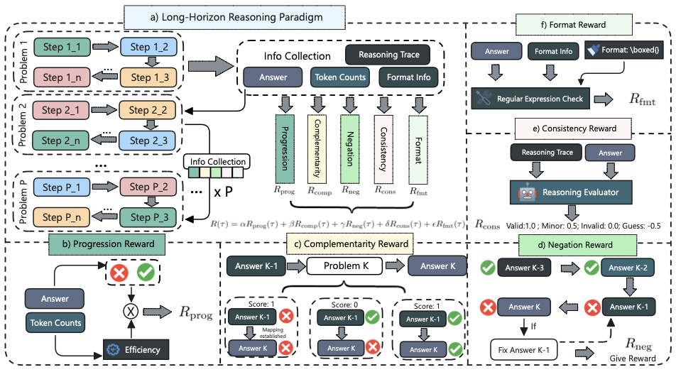
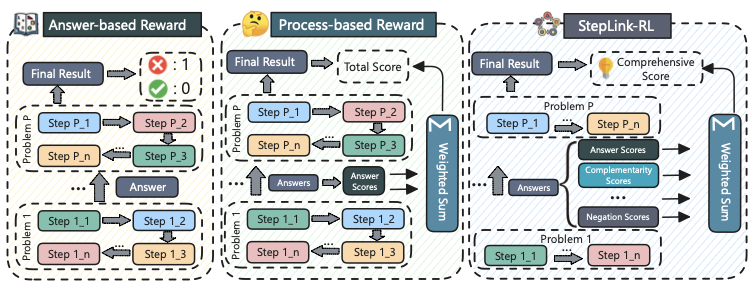
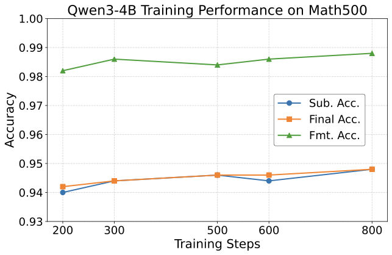
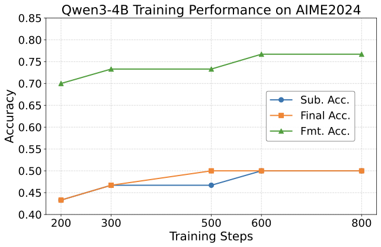
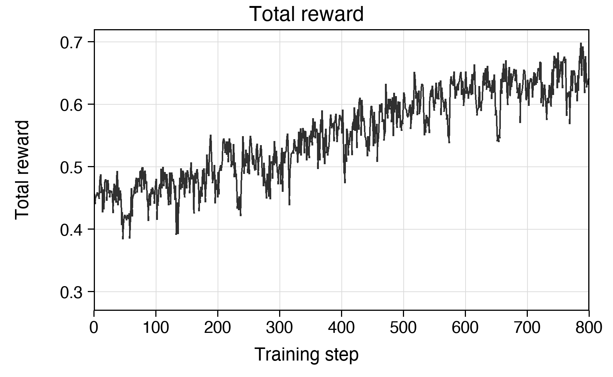
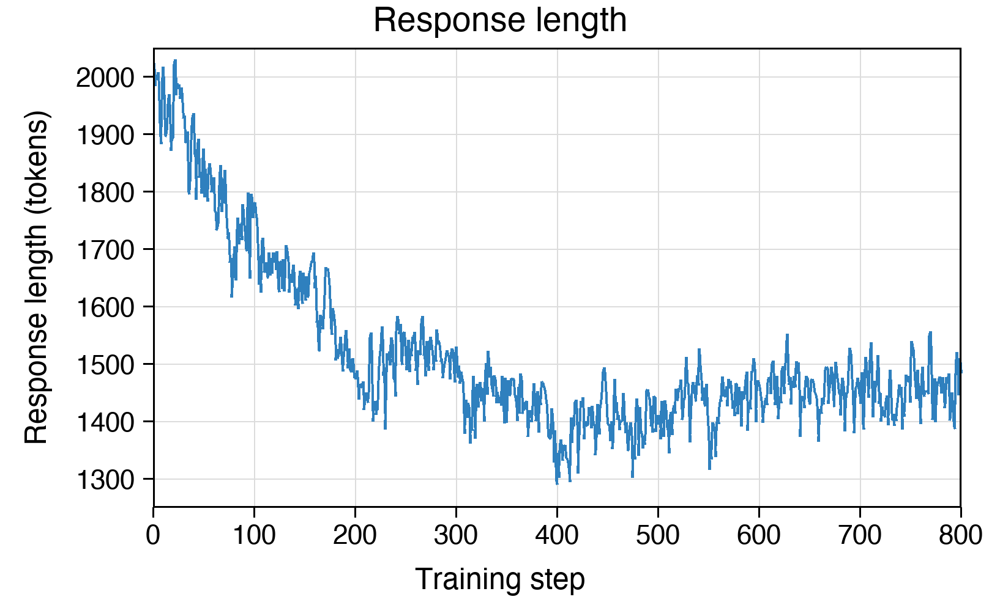

# StepLink-RL

StepLink-RL is a process-aware reinforcement learning framework for dependent
long-horizon mathematical reasoning. It trains language models to solve composed
reasoning chains where later sub-problems explicitly depend on answers produced
by earlier ones.

The project accompanies the paper **"StepLink-RL: Process-Aware Reward Shaping
for Long-Horizon Reasoning"**. Instead of relying only on a final-answer reward,
StepLink-RL injects reward signals at sub-problem boundaries and decomposes the
reasoning trajectory into interpretable process dimensions. This gives GRPO
training denser feedback about dependency use, reasoning consistency, answer
progress, and output regularity.

## Motivation

Long-horizon reasoning requires a model to maintain context, intermediate
variables, and cross-step dependencies across an extended reasoning chain. This
is harder than solving isolated single-step problems because early mistakes can
propagate, token budgets must be allocated across multiple sub-problems, and a
single final answer often cannot explain where the trajectory failed.

StepLink-RL studies this supervision problem for mathematical reasoning. It
constructs composed samples with explicit cross-problem dependencies, then uses
process-aware reward shaping to provide feedback at the sub-problem level rather
than only at the end of the full trajectory.

## Method Overview

StepLink-RL represents each long-horizon sample as a sequence of dependent
sub-problems. A later sub-problem may use a previous answer as an intermediate
variable, so the model must solve the chain sequentially and preserve dependency
information throughout the response.

The reward manager combines five process-level signals:

- **Progression reward**: whether each sub-problem is solved correctly within a
  reasonable token budget.
- **Complementarity reward**: whether later sub-problems correctly use previous
  answers or explicit dependency variables.
- **Negation reward**: whether the trajectory avoids verifiable mistakes and
  handles self-correction reasonably.
- **Consistency reward**: whether stated answers are supported by the generated
  reasoning process.
- **Format regularity reward**: whether the output is complete, stable, and easy
  to parse.

These signals are combined into a single trajectory reward and optimized with
GRPO-style reinforcement learning. The implementation keeps the reward granularity
at sub-problem boundaries: denser than final-answer supervision, but less brittle
than token-level imitation.

## Core Idea

The StepLink-RL framework treats a composed mathematical task as a linked chain
of sub-problems. It first collects answer, token-count, format, and reasoning
trace information from each sub-problem boundary, then maps those signals into
the five reward dimensions used for RL optimization.



Source figure: [framework PDF](assets/steplink-rl-framework.pdf).

The framework emphasizes where a long-horizon trajectory succeeds or fails:
whether the model reaches correct intermediate answers, uses prior answers as
dependencies, avoids propagating errors, keeps reasoning consistent with its
answers, and emits parseable final output.

## Reward Design Comparison

StepLink-RL is designed as a middle ground between sparse final-answer feedback
and overly rigid token-level process supervision.



Source figure: [reward comparison PDF](assets/steplink-rl-reward-comparison.pdf).

An answer-based reward only checks the final result, so it gives little guidance
about which sub-problem or dependency failed. A standard process-based reward can
score intermediate answers, but it still misses dependency use, correction
quality, consistency, and output regularity. StepLink-RL expands the process
signal into a weighted multi-dimensional reward, making the feedback more useful
for dependent long-horizon reasoning.

## Training Evidence

The paper includes several training visualizations for Qwen3-4B. Accuracy curves
track sub-problem accuracy, final-answer accuracy, and format accuracy across
training steps. The reward and length curves provide additional evidence about
optimization quality and token efficiency.



Source figure: [MATH500 training PDF](assets/steplink-rl-math500-training.pdf).

On MATH500, the model starts from a high base accuracy, so StepLink-RL brings
smaller but stable gains. This setting helps verify that the reward design does
not damage already strong mathematical reasoning behavior.



Source figure: [AIME2024 training PDF](assets/steplink-rl-aime2024-training.pdf).

On AIME2024, the improvement is more visible, showing that process-aware reward
shaping is especially useful on harder long-horizon reasoning tasks.



**Total Reward** denotes the average weighted trajectory reward. It increases
overall despite step-level fluctuations, suggesting that StepLink-RL provides a
learnable optimization signal.



**Response Length** denotes the average generated tokens per sub-problem. It
decreases early and then stabilizes at a lower range, indicating reduced
redundant reasoning while preserving enough tokens for problem solving.

## Repository Structure

```text
data_contruction/          Scripts for filtering, key-variable selection, and composed sample construction
evaluation/                Inference, extraction, and judging utilities
training/                  verl-based RL training code and reward managers
deployment/                Local deployment and training launch scripts
assets/                    Core idea diagrams and training evidence figures
requirements.txt           Python dependencies used by the project scripts
```

## Installation

```bash
git clone <your-repository-url>
cd StepLink-RL

conda create -n steplink-rl python=3.10 -y
conda activate steplink-rl

pip3 install torch==2.4.0 --index-url https://download.pytorch.org/whl/cu124
pip3 install flash-attn --no-build-isolation
pip install -r requirements.txt
```

Adjust the PyTorch and CUDA versions according to your hardware.

## Data Construction

The data construction pipeline converts independent mathematical problems into
composed long-horizon samples with explicit answer dependencies.

### 1. Filter Integer-Valued Samples

```bash
python data_contruction/step1_filt_integer_samples.py
```

This step keeps samples whose inputs contain valid integer variables and whose
targets are pure integers. Ambiguous numeric expressions such as fractions,
floats, or unresolved LaTeX commands are filtered out.

### 2. Select Key Variables

```bash
python data_contruction/step2_select_key_varible.py
```

This step identifies key variables: integers in the problem statement that
strongly affect the final answer. Configure the API endpoint and key in the
script or through your local environment before running it.

### 3. Compose Dependent Problems

```bash
python data_contruction/step3_combine_problems.py
```

This step links multiple sub-problems into one long-horizon sample. A later
problem can use the previous answer as an intermediate variable, forming a
verifiable cross-problem dependency chain.

## Training

The training code is based on `verl` and supports GRPO-style optimization with
the process-aware dense reward manager.

Prepare your training and validation data under `training/data/`, then launch a
Ray job from the `training/` directory:

```bash
export MODEL_PATH="/path/to/your/base/model"
export TRAIN_DATA_DIR="./data"
export OUTPUT_DIR="./checkpoints/steplink-rl-run"
mkdir -p "$OUTPUT_DIR"

ray start --head --port=29500 --num-gpus=4 --include-dashboard=false

ray job submit \
  --address "127.0.0.1:29500" \
  --runtime-env="./verl/trainer/runtime_env.yaml" \
  --working-dir="." \
  -- python3 -m verl.trainer.main_ppo \
    reward_model.reward_manager=dense_chain \
    algorithm.adv_estimator=grpo \
    data.train_files='["'"${TRAIN_DATA_DIR}/your_train.parquet"'"]' \
    data.val_files='["'"${TRAIN_DATA_DIR}/your_val.parquet"'"]' \
    actor_rollout_ref.model.path="${MODEL_PATH}" \
    trainer.default_local_dir="${OUTPUT_DIR}" \
    trainer.n_gpus_per_node=4 \
    trainer.nnodes=1

ray stop
```

### Training Details

All methods use the same data construction and inference settings. For
reinforcement learning baselines, GRPO is used as the optimization framework,
and these baselines differ only in reward design. The default StepLink-RL
experiment setting is:

- total training steps: `800`
- actor learning rate: `5e-7`
- rollout temperature: `0.8`
- training batch size: `4` prompts per step
- group size: `16` candidate responses per prompt

Here, batch size denotes the number of prompts used in each training step, while
group size denotes the number of candidate responses sampled for each prompt.
Experiments are conducted on NVIDIA RTX 4090 GPUs with 24GB memory, using
gradient accumulation and group-wise rollout sampling to support GRPO training.

The process-aware reward weights are configured in
`training/verl/trainer/config/ppo_trainer.yaml`:

```yaml
data:
  train_batch_size: 4

actor_rollout_ref:
  actor:
    optim:
      lr: 5e-7
  rollout:
    temperature: 0.8
    n: 16

reward_model:
  reward_manager: dense_chain
  dense_reward:
    reward_weights:
      prog: 0.4
      comp: 0.2
      neg: 0.15
      cons: 0.15
      form: 0.1

trainer:
  total_training_steps: 800
  n_gpus_per_node: 4
```

For the process-aware reward in StepLink-RL, the weights are set to `0.4`,
`0.2`, `0.15`, `0.15`, and `0.1` for progression, complementarity, negation,
consistency, and format rewards, respectively. For reward terms requiring
semantic judgment, including complementarity, negation, consistency, and format
clarity, DeepSeek is used as an OpenAI-compatible LLM judge with numeric-output
prompts.

## Evaluation

Create a local evaluation config from the template:

```bash
cp evaluation/config.example.json evaluation/config.json
```

Edit `evaluation/config.json` with your inference endpoint, model name, and API
keys. Then run:

```bash
sh evaluation/run.sh evaluation/data/<dataset>/<file>.jsonl evaluation/result my-vllm-model
```

For training-time AIME-style checks, the default lookup paths are:

```text
evaluation/data/AIME24/AIME24-origin.jsonl
evaluation/data/AIME24/AIME24-combined-n2.jsonl
evaluation/data/AIME25/AIME25-origin.jsonl
evaluation/data/AIME25/AIME25-combined-n2.jsonl
```

You can modify these paths in
`training/verl/trainer/aime_eval_metrics.py` if your local evaluation files use a
different layout.

## Data Format

Each composed sample is expected to contain a chat prompt plus metadata used by
the reward manager:

```json
{
  "prompt": [
    {
      "role": "user",
      "content": "Problem 1: ...\n\nProblem 2: ..."
    }
  ],
  "reward_model": {
    "style": "rule",
    "ground_truth": ["answer1,answer2"]
  },
  "extra_info": {
    "composed_query_num": 2,
    "dependencies": [["variable2", "answer1 + c"]]
  }
}
```

The reward manager also accepts several equivalent target layouts, including
`target`, `group_targets`, comma-separated targets, and nested boxed LaTeX
answers.

## Current Scope

This repository currently focuses on mathematical long-horizon reasoning with
Qwen-style causal language models and GRPO training. The implementation is still
research-oriented: paths, data names, and launch parameters should be adjusted to
your local cluster and dataset layout.
